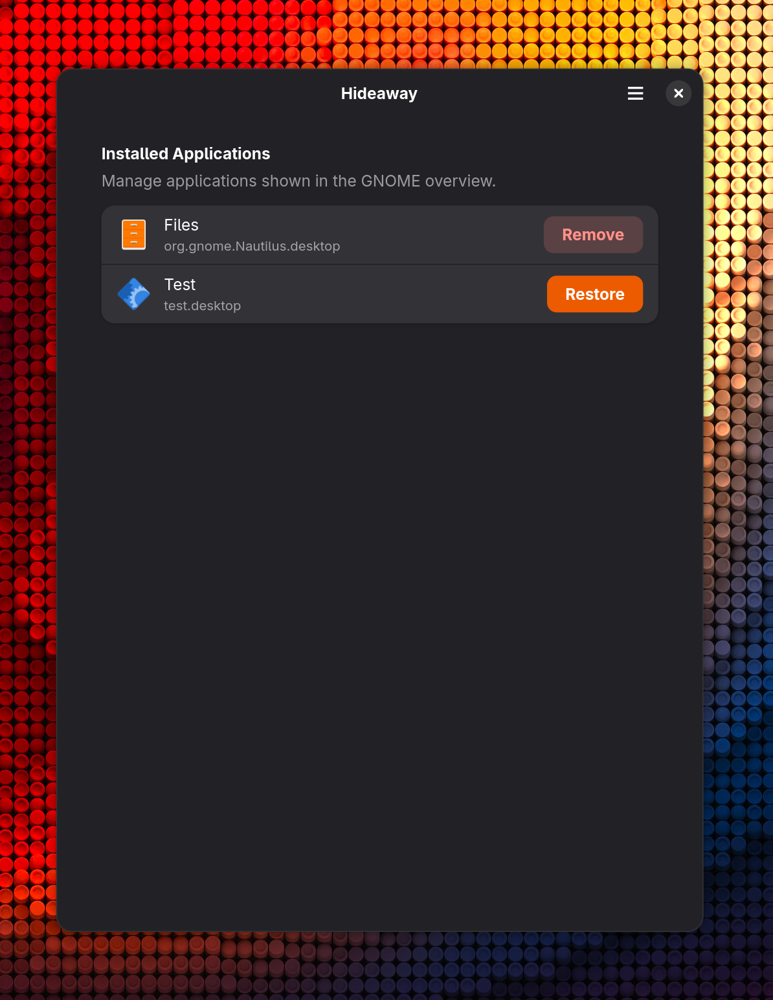

<div align="center">
  
  <h1>Hideaway</h1>
</div>

Hideaway is a small libadwaita app that allows you to remove elements from your gnome app list.

## Running from source
If you just want to test it out directly from the source:
```bash
python3 src/main.py
```

## Screenshots

